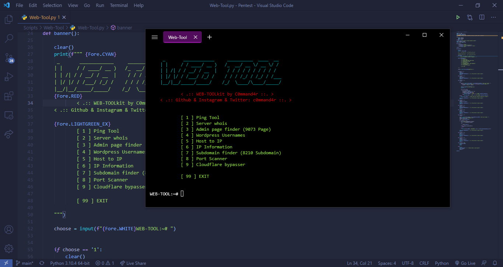

# WEB-TOOLkit

Web-Tool is a simple tool for web hacking



## Usage

Just run script

Requirements will be installed automatically

```bash
# clone from github with git
$ git clone https://github.com/msfpt/Web-Tool

# run `./Web-Tool/__main__.py` python script
$ python3 Web-Tool
```

## Capabilities
1. Ping Tool
2. Server whois
3. Admin page finder
4. Wordpress Usernames
5. Host to IP
6. IP Information
7. Subdomain finder
8. Port Scanner
9. Cloudflare Bypasser
