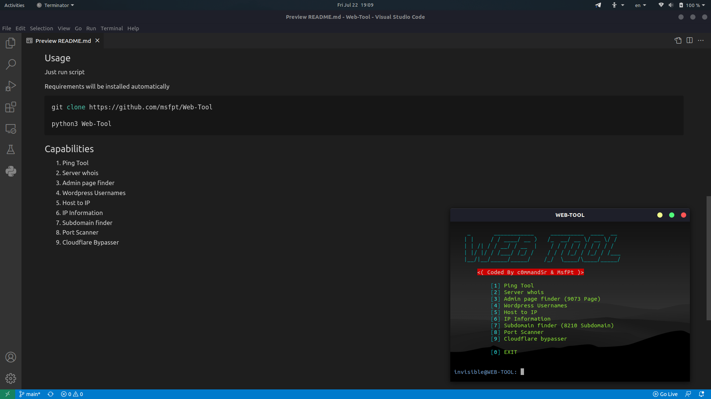

# WEB-TOOLkit
Web-Tool is a simple tool for web hacking


## Usage
#### Just run script
#### Requirements will be installed automatically
```
$ git clone https://github.com/c0mmand4r/Web-Tool
$ cd Web-Tool
$ python3 Web-Tool.py
```

## Capabilities
#### 1- Ping Tool
#### 2- Server whois
#### 3- Admin page finder
#### 4- Wordpress Usernames
#### 5- Host to IP
#### 6- IP Information
#### 7- Subdomain finder

## Contact
- Twitter & Instagram: @C0mmand4r